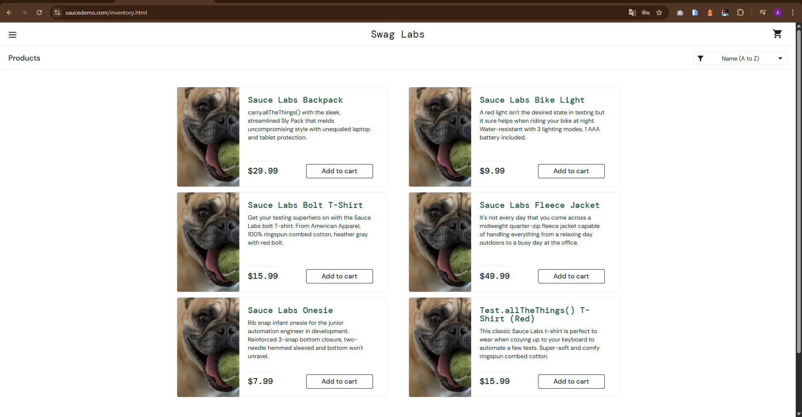

### [BUG-001] Mensagem de Erro Inadequada no Login
* **Status na Planilha:** ID 3 (NOK).
* **Título:** [Login] Exibição de mensagem de erro não amigável ao inserir senha incorreta.
* **Severidade:** Baixa (Interface/Experiência do Usuário).
* **Ambiente: Web:** Swag Labs.

 **Passos para Reproduzir:**
   1. Acessar a página de login do Swag Labs.
   2. Inserir um usuário válido (ex: standard_user).
   3. Inserir uma senha propositalmente incorreta.
   4. Clicar no botão "Login".

**Resultado Esperado:** O sistema deve exibir uma mensagem clara e amigável, orientando o usuário sobre o erro na senha.

**Resultado Atual:** A mensagem retornada não é amigável ou clara para o usuário final.

**Evidência:**

  
📸 Clique para ver a captura de tela (Imagem 01)

   
  

---

### [BUG-002] Duplicidade de Imagens no Inventário
* **Status na Planilha:** ID 4 (NOK).
* **Título:** [Inventário] Falha na integridade dos dados: imagens de produtos carregam repetidas.
* **Severidade:** Média (Funcionalidade Visual).
* **Ambiente: Web:** Swag Labs (identificado via problem_user).

**Passos para Reproduzir:**
1.  Realizar login com as credenciais do `problem_user`.
2.  Visualizar a lista de produtos na página de inventário.

**Resultado Esperado:** Cada produto deve exibir sua respectiva imagem única e correta.

**Resultado Atual:** As imagens dos produtos estão carregando de forma repetida, não correspondendo ao item listado.

**Evidência:**

  
📸 Clique para ver a captura de tela (Imagem 02)

   
  

---

### [BUG-003] Falha na Alternância do Botão "Add to cart"
* **Status na Planilha:** ID 5 (NOK).
* **Título:** [Inventário] Botão de ação não altera o estado de "Add to cart" para "Remove" após o clique.
* **Severidade:** Alta (Impede o fluxo esperado de gerenciamento do carrinho).
* **Ambiente: Web:** Swag Labs.

**Passos para Reproduzir:**
1. Logar no sistema e acessar a lista de produtos.
2. Clicar no botão "Add to cart" em diferentes produtos da lista.
3. Tentar clicar em "Remove" para retirar um item.

**Resultado Esperado:** O botão deve mudar visualmente de "Add to cart" para "Remove" imediatamente após a inclusão, e vice-versa ao remover.

**Resultado Atual:** Nem todos os botões mudam para "Remove" ou retornam ao estado inicial ao serem clicados.

**Evidência:**

  
📸 Clique para ver a captura de tela (Imagem 03)

   
  

