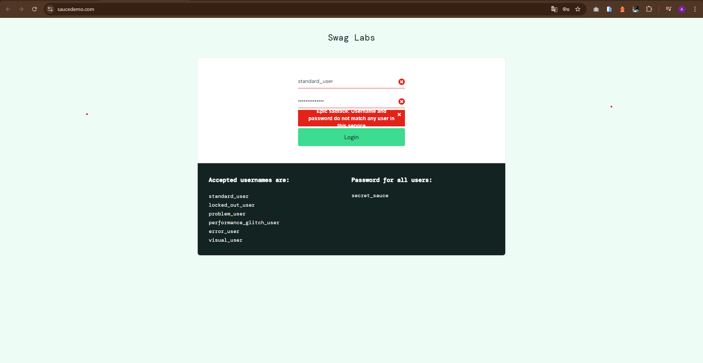
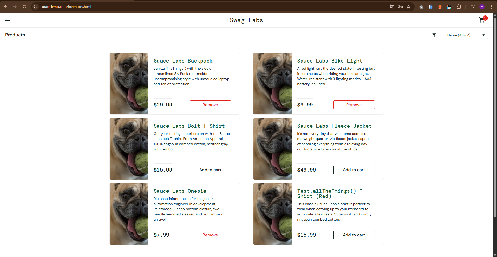

### [BUG-001] Mensagem de Erro Inadequada no Login

- **Status na Planilha:** ID 3 (NOK).
- **Título:** [Login] Exibição de mensagem de erro não amigável ao inserir senha incorreta.
- **Severidade:** Baixa (Interface/Experiência do Usuário).
- **Ambiente: Web:** Swag Labs.

  **Passos para Reproduzir:**
  1.  Acessar a página de login do Swag Labs.
  2.  Inserir um usuário válido (ex: standard_user).
  3.  Inserir uma senha propositalmente incorreta.
  4.  Clicar no botão Login.

**Resultado Esperado:** O sistema deve exibir uma mensagem clara e amigável, orientando o usuário sobre o erro na senha.

**Resultado Atual:** A mensagem retornada não é amigável ou clara para o usuário final.

**Evidência:**

  
📸 Clique para ver a captura de tela (Imagem 01)

   
  

---

### [BUG-002] Duplicidade de Imagens no Inventário

- **Status na Planilha:** ID 4 (NOK).
- **Título:** [Inventário] Falha na integridade dos dados: imagens de produtos carregam repetidas.
- **Severidade:** Média (Funcionalidade Visual).
- **Ambiente: Web:** Swag Labs (identificado via problem_user).

**Passos para Reproduzir:**

1.  Realizar login com as credenciais do `problem_user`.
2.  Visualizar a lista de produtos na página de inventário.

**Resultado Esperado:** Cada produto deve exibir sua respectiva imagem única e correta.

**Resultado Atual:** As imagens dos produtos estão carregando de forma repetida, não correspondendo ao item listado.

**Evidência:**

  
📸 Clique para ver a captura de tela (Imagem 02)

   
  

---

### [BUG-003] Falha na Alternância do Botão Add to cart

- **Status na Planilha:** ID 5 (NOK).
- **Título:** [Inventário] Botão de ação não altera o estado de Add to cart para Remove após o clique.
- **Severidade:** Alta (Impede o fluxo esperado de gerenciamento do carrinho).
- **Ambiente: Web:** Swag Labs.

**Passos para Reproduzir:**

1. Logar no sistema e acessar a lista de produtos.
2. Clicar no botão Add to cart em diferentes produtos da lista.
3. Tentar clicar em Remove para retirar um item.

**Resultado Esperado:** O botão deve mudar visualmente de Add to cart para Remove imediatamente após a inclusão, e vice-versa ao remover.

**Resultado Atual:** Nem todos os botões mudam para Remove ou retornam ao estado inicial ao serem clicados.

**Evidência:**

  
📸 Clique para ver a captura de tela (Imagem 03)

   
  

---

### [BUG-004] Falha de Validação de Formato no Campo Postal Code

- **Status na Planilha:** ID 10 (NOK).
- **Título:** [Checkout] Campo de CEP permite a inserção de letras e caracteres especiais sem validação.
- **Severidade:** Média (Permite a entrada de dados inválidos no banco de dados).
- **Ambiente: Web:** Swag Labs.

**Passos para Reproduzir:**

1. Avançar para a tela Checkout: Your Information.
2. Inserir letras ou caracteres especiais no campo Zip/Postal Code.
3. Clicar em Continue e observar que o sistema permite o avanço para a revisão da compra.

**Resultado Esperado:** O sistema deve validar o formato do campo e impedir o avanço caso o CEP contenha caracteres não numéricos.

**Resultado Atual:** O campo aceita qualquer tipo de caractere, permitindo finalizar a compra com dados inválidos.

**Evidência:**

  
📸 Clique para ver a captura de tela (Imagem 04)

   
  

---

### [BUG-005] Quebra de Integridade Visual no Carrinho

- **Status na Planilha:** ID 11 (NOK).
- **Título:** [Cart (UI)] Cabeçalho desalinhado e ausência de imagens dos produtos na listagem.
- **Severidade:** Baixa (Interface/Experiência do Usuário).
- **Ambiente: Web** Swag Labs.

**Passos para Reproduzir:**

1. Adicionar um ou mais produtos ao carrinho.
2. Clicar no ícone do carrinho para visualizar a lista de itens (/cart.html).

**Resultado Esperado:** O cabeçalho da tabela deve estar alinhado com os itens e cada produto deve exibir sua respectiva imagem.

**Resultado Atual:** O cabeçalho está desalinhado em relação ao corpo da tabela e as imagens dos produtos não são carregadas.

**Evidência:**

  
📸 Clique para ver a captura de tela (Imagem 05)

   
  

---

### [BUG-006] Ausência de Feedback Visual (Hover) no Ícone do Carrinho

- **Status na Planilha:** ID 12 (NOK).
- **Título:** [Interface (UX)] Falha na implementação de efeito de 'Hover' no ícone de acesso ao carrinho.
- **Severidade:** Baixa (UX).
- **Ambiente: Web:** Swag Labs.

**Passos para Reproduzir:**

1. Estar logado em qualquer página do sistema.
2. Posicionar o cursor do mouse sobre o ícone do carrinho no canto superior direito.

**Resultado Esperado:** O ícone deve apresentar uma mudança visual (cor, opacidade ou escala) para indicar que é um elemento interativo.

**Resultado Atual:** O ícone não apresenta nenhuma reação visual ao passar o mouse.

**Evidência:**

 
 

📸 Clique para ver a captura de tela (Imagem 06)

